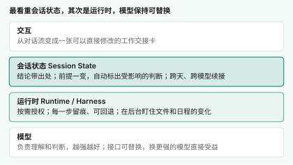
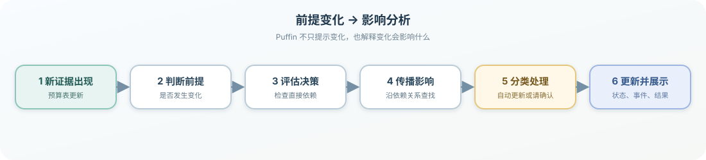
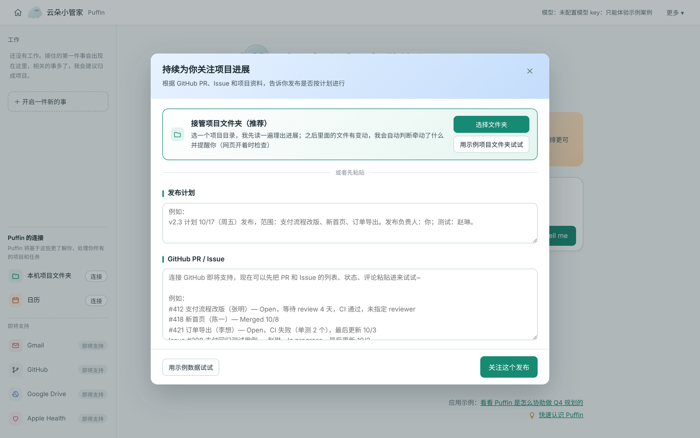
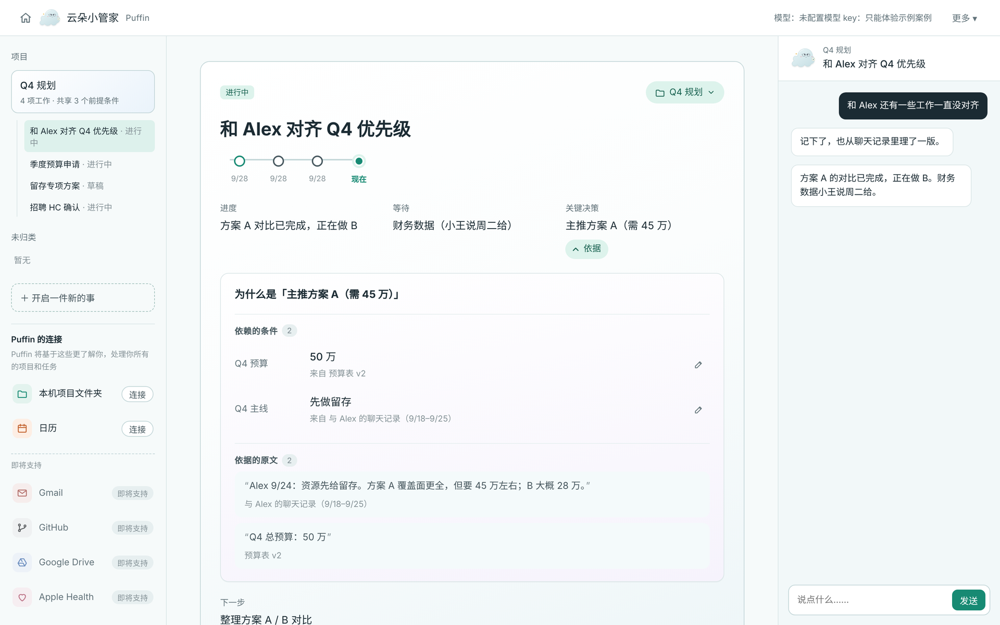
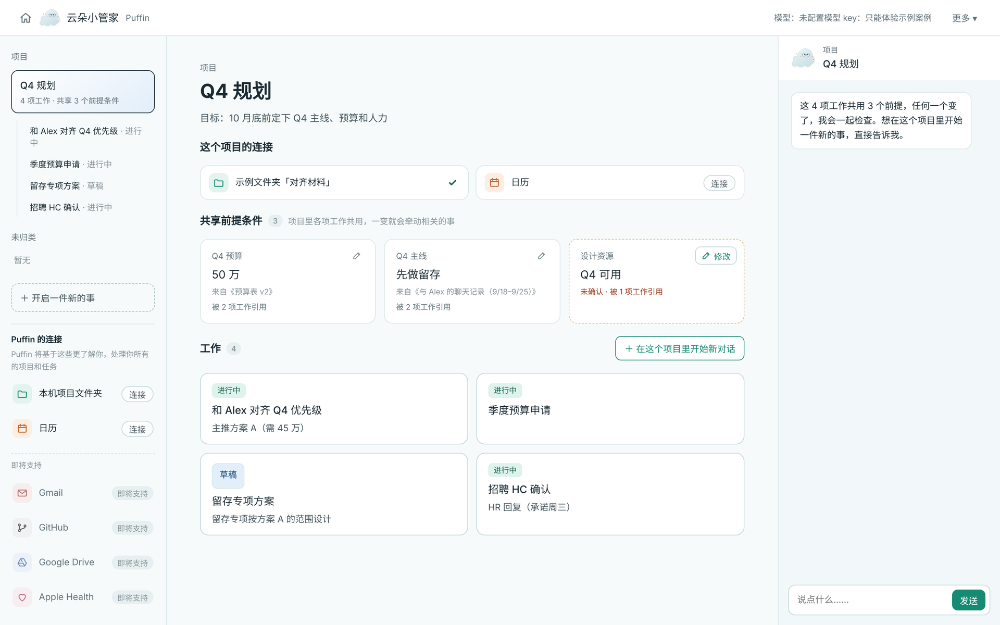
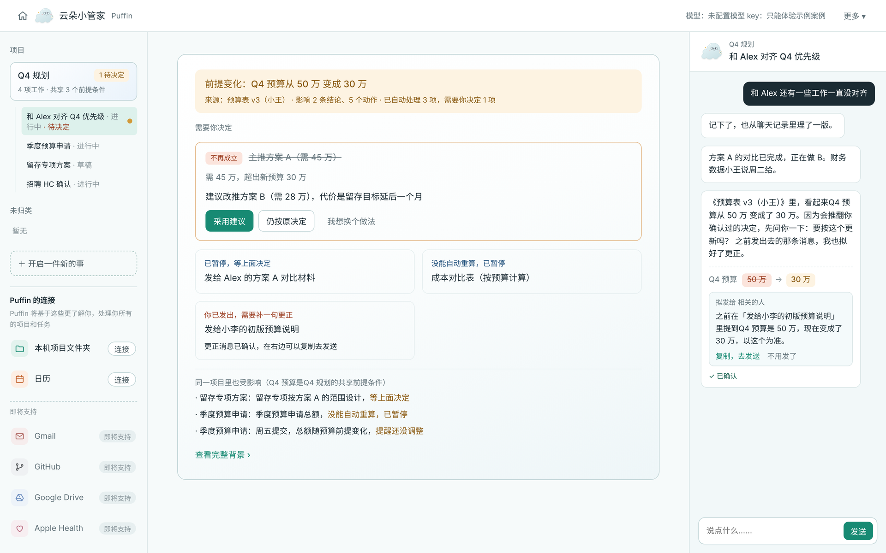
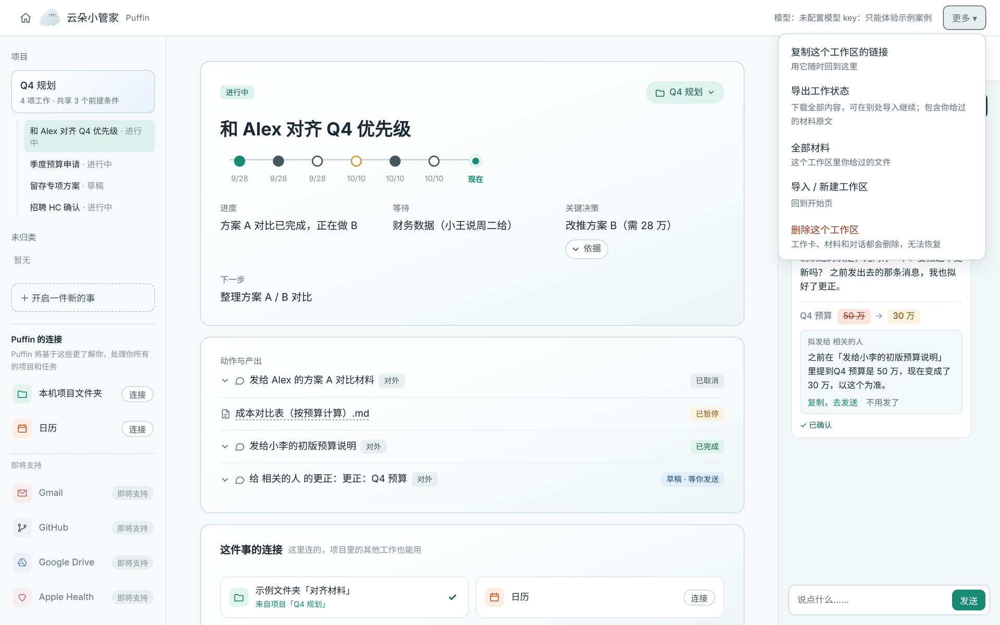
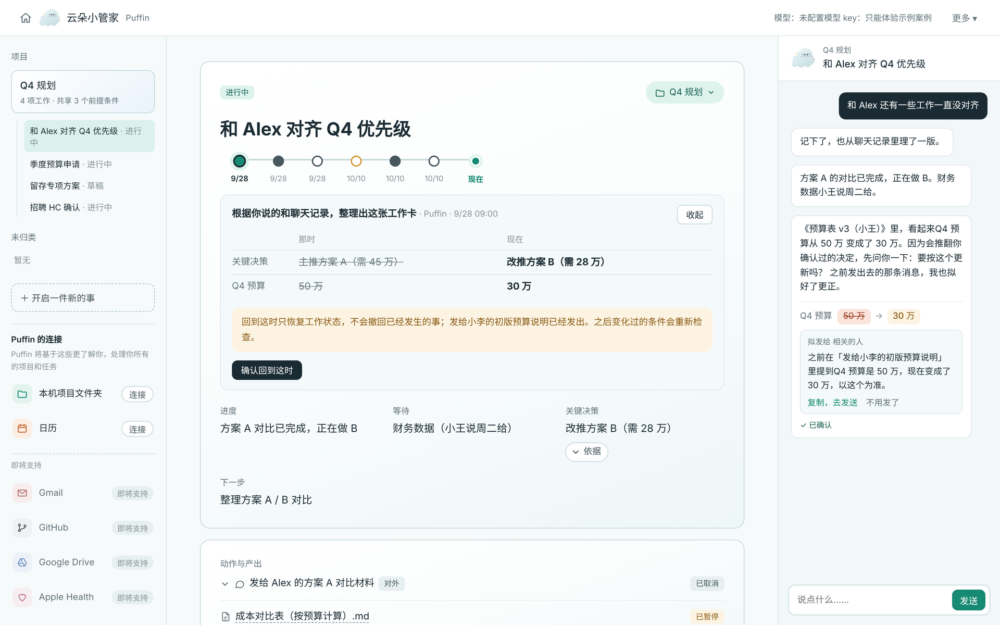

# Puffin 云朵小管家 · 产品说明

## 一个让用户反复卡住的问题

**一项持续变化的工作，怎样才能放心地交给 Agent？**

> 设想这样一个场景：周一，你和 AI 商量好 Q4 主推方案 A，当时的前提是预算 50 万。周二，同事发来新版预算表，预算只剩 30 万。
>
> AI 对此一无所知。它上周一给出的建议还原封不动地摆在那里，那条准备发给同事的消息也仍在草稿箱里。除非你自己想起来，否则这个错误很可能就会这样发出去。

这不是个别情况。真实工作很少在一轮对话里结束，而今天的 Agent 在“跨时间”这件事上普遍做得不好：

- **断片**：做到哪一步了、为什么这么做，都埋在长长的聊天记录里。
- **过时**：条件变了，它不会告诉你哪些结论已经不成立。
- **边界不清**：它能看到什么、会不会替你发出去，你也说不清。

很多产品的解法是让 Agent“记得更多”。但如果只是做历史检索，最终仍然需要用户自己判断：哪些内容过时了，哪些决定已经执行，哪些话只是当时的想法。

所以我认为，Agent 真正的价值是**持续守住“工作约定”**：知道自己在做什么、凭什么这么做；条件变了，主动告诉你影响了什么。

可以把它想象成一位优秀的总裁秘书。她的价值不在于记住老板说过的每一句话，而在于：

- **心里有一本账**：哪些事在推进、各自卡在哪里、为什么当初这么定，随时说得清。
- **变化先到她这里**：会议改期、预算变化后，她会先想清楚影响了哪些安排，再带着建议去找老板。
- **知道分寸**：小事自己处理；需要拍板或不可撤回的事，一定先问清楚。她能碰什么、不能碰什么，双方都明确。
- **交接无缝**：她休假时留下的交接单，让代班的人拿起来就能接着做。

> Puffin这个产品 demo 想演示的，就是这样一位秘书。

## 最近的行业信号

这几周，Personal Agent 和配套模型密集出现，方向很有代表性：

- **[Muse](https://about.fb.com/news/2026/09/introducing-muse-personal-ai-agent/)（Meta）**：给每个用户一台云端专属虚拟机，让 Agent 能在后台跨会话持续工作。
- **[Cue](https://thenextweb.com/news/manus-2-0-cue-ai-agents-email-phone-wallet)（Manus）**：给每个 Agent 配备专属邮箱、手机号、钱包和电脑，可以在预算内发消息、付款、代接电话，多个 Agent 还能在群聊中协作。
- **[Instinct](https://www.vktr.com/ai-platforms/instinct-raises-1b-at-10b-valuation-to-scale-its-personal-ai-agent/)**：用户通过短信或电话交代事情，它用自己的手机和电脑订餐、取消订阅。
- **[Jev](https://viblo.asia/p/jev-la-gi-mo-hinh-ai-tra-ve-xac-suat-thay-vi-text-va-vi-sao-dieu-do-quan-trong-khi-build-agent-bA468ol9LKv)（TypeSafe AI）**：一个不生成文字、直接返回校准概率的模型，专门用于 Agent 判断。

前两个在解决“Agent 能不能一直替你做事”，Jev 在解决“模型的判断能不能被程序可靠地使用”。它们都说明，行业正从“聊得好”转向“长期、可靠地做事”。但还有一个问题很少有人正面回答：**Agent 在后台做了这么多，用户怎么知道它的判断仍然成立？** Puffin 想补的就是这一块。

#### **Agent2Agent 为什么还没有成熟产品**

另一个值得注意的现象是 Agent2Agent。这个概念在行业里被反复提起，却还没有成熟产品。我的判断是：单个 Agent 还没有做到让用户放心把所有信息交给它，讨论多个 Agent 之间的交接还为时过早。

**先把一个 Agent 的运行时和会话状态做到可信、可沉淀，它们才会成为平台的核心资产。** 将来 Agent 之间要协作，交接的也正是这份状态。

## 我的判断：把精力花在哪一层

做 Agent 产品，每一层都有人在发力：更强的模型、更多的工具、更长的记忆。

我把一个 Agent 从下往上拆成四层。最终的答案是：最看重会话状态，其次是运行时；模型层不是这个原型的重点。

#### **第一层：会话状态，从“聊天上下文”升级为“工作状态”**

我把对话看作输入通道，而不是产品的最终状态。Puffin 真正保存的是：工作卡、项目、前提、证据、决策、动作、提醒、授权和事件。用户从工作卡就能看到目标、进展、等待项和下一步，不需要翻阅长对话来恢复上下文。

每个重要结论都有来源链：

例如“主推方案 A”关联到“预算 50 万”和“先做留存”，这两个前提又分别关联预算表和聊天记录。这样做的价值，是把“相信 Agent”变成“检查 Agent”：用户不需要相信模型的隐式记忆，而是能够看到它为什么这样判断。

哪些是材料里的事实，哪些是 Puffin 的推断，哪些经你确认过，哪些已经做了，Puffin 都分开记录；前提改过几次，也都留着记录。聊天中的一句话不会自动变成长期事实，必须经过用户确认。这份状态也不属于任何一个模型，因此才能支持变化传播、回退和跨会话续接。

#### **第二层：运行时，关键逻辑不交给模型自由发挥**

Puffin 基于开源 Pi 搭建。我让模型只做三类事情：从材料中提取结构、判断新证据是否改变某个决策、生成替代建议或补救草稿。

以下事情由确定性程序处理：

- 依赖图遍历和影响范围计算；
- 授权检查：用到哪个文件夹、哪个日历，就在需要时申请，并写清范围和用途；
- 按撤回成本分类；
- 事件记录：不只记录“做了什么”，也记录“为什么”和“依据是什么”；
- 状态持久化与导出。

原因很直接：模型可以判断“方案 A 可能不成立”，但不能因为一次输出波动，就漏掉一个下游动作，或者把已经发出的消息当成可以撤回。

#### **交互层：变化不是通知，而是影响分析**

很多系统能告诉用户“文件更新了”，却没有回答“这对我正在做的工作意味着什么”。

Puffin 把前提变化看作一个事件，沿决策依赖图找出下游影响，并按可撤回程度分类：

- 需要用户决定；
- 暂停等待；
- 自动更新；
- 已对外发生，需要补救；
- 不受影响。

处理过程如下：

这个设计把 Agent 的主动性，从“我替你做更多事”改成“我替你发现变化，并把变化的后果整理好”。对真实的知识工作来说，这比没有边界的自动执行更合适。

结果呈现在一张可以直接修改的工作卡上，而不是一条滚动的对话里。人和 Agent 的关系正在从一问一答，变成长期、多件事并行的合作；单纯的对话流装不下这些。

#### **模型层：让模型能力真正落到工作里**

模型是 Agent 的引擎，模型越强，Puffin 的判断就越准。这次原型没有把重点放在模型本身，而是关注如何把模型能力嵌入一个长期、可解释、可持续的工作闭环中，原因有两个：

1. 模型能力只有进入真实工作流，转化为结构化状态、可靠判断和可执行的下一步，才能真正形成用户价值。Puffin 重点验证的，正是这层连接如何建立。
2. 模型越强，用户越愿意把长线工作交给它，而长线工作恰恰最依赖状态和运行时。没有这两层，再强的模型到了第二天也会断片。

Puffin 的模型接口按可替换的方式设计。换成更强的模型，整个产品都会直接受益。

#### **从模型到平台：共享状态和运行时的价值**

如果用户的工作状态、决策记录和授权历史都锁在某一个模型里，模型切换就意味着重新交代背景，平台也很难形成长期积累。Puffin 把这部分状态放在模型之上，带来几个直接价值：

- **降低平台锁定**：用户的工作状态不属于某一个模型，换模型时仍然可以继续当前工作；
- **积累工作深度**：同一份状态可以被不同会话、项目和 Agent 继续使用，用户不必反复从头授权和解释；
- **一次授权，持续生效**：授权范围和历史记录保存在工作状态里，用户不必每次进入新 Agent 都重新确认；
- **减少上下文成本**：子 Agent 和新会话直接读取结构化状态，不需要重复拼接完整 transcript，长期协作也更稳定。

同样，运行时也不只是把工具接上就结束了。连接器、权限检查、事件记录、等待、调度和失败恢复如果由平台统一处理，新接入的 Agent 才能共享一套可靠的基础设施。它还让平台能够统一处理安全审计、合规、计费和长期运行，而不是把这些能力重复建设在每个 Agent 里。

这也是 Puffin 把交互重点放在“授权、依据和变化”上的原因：用户需要管理的不是某个模型的聊天，而是平台上持续存在的一份工作状态和一组行动边界。

当然，共享状态也会带来新的风险：错误可能被长期继承，权限和隐私风险会集中到平台，用户也可能担心再次被平台锁定。因此，Puffin 把来源、授权、状态层级、导出和模型切换都做成可见、可追溯、可回退的能力。

#### **Puffin 要解决的五个问题**

前面的设计，最终都落到这五个问题上：

| 你想知道的 | Puffin 是怎么做的 |
| --- | --- |
| 你现在在替我做什么？ | 工作交接卡 |
| 你凭什么这么判断？ | 每条前提和决定旁边的出处 |
| 你能动我的什么？ | 授权清单：范围、用途，随时可撤销 |
| 有什么变了？ | 变化提醒，以及受影响的判断和待办 |
| 我反悔了怎么办？ | 时间线、回退、导出，换个模型也能接着做 |

## 花十分钟体验一遍

打开 Puffin，你会看到一个已经准备好的项目“Q4 规划”：10 月底前定下 Q4 的主线、预算和人力。

#### **1. 把事情交给它**

你说出目标，再递给它一个文件夹，里面是和同事 Alex 的聊天记录及一份预算表。Puffin 不会直接开始读取，而是先告诉你：只读这个文件夹，仅用于这个项目，不会对外发送任何东西。

接管文件夹前，先说明只读、读什么、用来做什么

#### **2. 收到一张工作卡片**

它把材料整理成一张卡片，每条信息旁边都写明来源：

- **前提**：预算 50 万、先做留存；
- **建议**：主推方案 A；
- **待办**：给 Alex 发一条对齐消息。

工作卡：进度、等待、关键决策，点开「依据」可以看到条件和原文出处

#### **3. 纠正它**

卡片上有一条“设计资源 Q4 可用”还未确认。你可以直接在卡片上修改，与它相关的待办也会随之更新。

项目里的共享前提：「设计资源」还未确认，可以直接修改

#### **4. 对于变化的主动提醒**

把新版预算表放进文件夹，预算变成 30 万。你什么都不用说，Puffin 就会来提醒：**方案 A 需要 45 万，它的前提已经不成立。** 那条给 Alex 的消息会先暂停，等你做决定。日历上的评审被挤占时，也会出现同样的提醒。

预算变成 30 万后的影响分析：方案 A 不再成立，对外消息先暂停，已发出的补一句更正

#### **5. 换个模型接着做**

工作状态保存在 Puffin，而不是某个模型的对话里，因此换一个模型也能从交接卡直接接着做。这一期只接入了一个模型，但切换和续接能力已经准备好。

导出工作状态，可以在别处导入后接着做

#### **6. 留一份收据**

时间线上记录了发生了什么、依据是什么、是谁拍的板。改动可以回退，整份状态也可以导出带走。

时间线：回到 9/28 对比当时和现在；回退只恢复工作状态，不撤回已发出的消息

## 几条设计原则

#### **1. 先建立工作，再提取长期信息**

产品不做“启动时填写一堆偏好”的复杂 onboarding。用户先把一件真实工作交给 Puffin，系统在完成工作时自然形成可复用的状态。用户不知道从哪里开始时，Puffin 会提供示例工作台，并根据已有材料和日程主动提议可以推进的事。

这背后的原则是：价值在前，记忆在后；只有对当前工作有用的信息，才值得被保留。

#### **2. 按需授权，而不是一次要走所有权限**

一上来就要邮箱和硬盘的全部访问权，用户要么拒绝，要么即使答应也不踏实。Puffin 只在具体工作需要时，申请对应的一小块权限，并写清范围和用途；所有对外动作目前只起草，由用户确认后自行发出。

#### **3. 一个对外 Agent，共享一份黑板状态**

内部可以有感知、规划、执行和审查等不同能力，但对用户只呈现一个 Puffin。

我没有把它设计成多个需要用户自己协调的 Agent，因为那会把系统内部的组织成本转嫁给用户。不同内部角色共享同一份状态，也避免了子 Agent 之间通过消息转述造成的信息压缩。

#### **4. 只在值得打扰时才打扰**

主动不等于频繁提醒。能自己处理的变化安静地记进时间线；只有需要用户拍板时，Puffin 才会主动提醒，并一次说清楚变了什么、影响什么、需要用户做什么。

#### **5. 变化不静默覆盖，回退不假装撤销现实**

用户可以回到时间线上的某个状态，查看当时的工作卡和决策。但如果某条消息已经对外发出，回退只能恢复内部工作状态，不能假装现实世界没有发生过。

这类边界会让产品少一些“看起来全自动”的魔法，却更符合用户对可靠性的期待。

## 当前版本与后续计划

#### **这一版已经可以**

- 在网页里上传或粘贴材料，用对话描述目标；
- 把电脑上的一个文件夹设为工作目录（需要 Chrome 或 Edge）；
- 接入日历链接，在日程变化时指出对项目的影响；
- 提供交接卡、出处、变化提醒、时间线、回退和导出。

#### **Demo 目前的不足与后续迭代方向**

当前 Demo 主要验证了工作状态的建立、前提变化的传播和跨会话续接，但来源覆盖和后台持续运行能力仍然有限。下一步会优先接入更多会变化的信息来源，让 Puffin 能更早发现影响工作的前提变化。每接入一个来源，就多一类可以被自动发现和更新的“前提”：

- **GitHub、Linear 等项目工具**：PR 合并、任务延期、里程碑变化都会影响发布计划。接入后，Puffin 能在“这个 PR 还没合”时提醒你：周五的发布和预告邮件可能需要调整。
- **Apple Health**：睡眠和运动数据反映你的精力状态。它只被当作“时间和精力”类的条件，比如这周睡得少，就建议把非紧急的事往后排，而不对你的身体做任何判断。
- **邮件、飞书、Slack**：大部分条件变化最先出现在沟通中。接入后，同事一句“预算可能要缩”就能触发提醒，而不必等新版表格出现。
- **会议纪要**：决定和分工最常在会上产生。接入后，会上定下的事会直接变成交接卡上的前提和待办。

来源越敏感，授权就越谨慎。顺序上会先接文件类来源，再接实时沟通，最后才是健康这类最私人的数据。

## 这个设计带来的价值

#### **对用户的直接价值**

- 减少每次重新交代背景的成本；
- 降低因资料变化导致的遗漏和过时产出；
- 让 Agent 的结论可追溯、可纠正；
- 让主动提醒和自动处理有明确边界；
- 支持暂停、恢复、导出和模型切换。

#### **对产品的长期价值**

大多数 Agent 产品首先优化“能不能运行、能不能调用工具、能不能持续执行”。Puffin 试图补上运行时之上的语义层：工作约定如何被记录，结论如何追溯，条件变化如何传播，用户何时必须介入。

它的差异化不在于再造一个聊天窗口，而在于让持续工作的 Agent 具备一份用户能够理解、也真正拥有的状态。

## 最后的思考

**Puffin 云朵小管家不是一个“记住更多内容”的 Agent，而是一个把持续工作变成可解释、可校正、可授权、可恢复状态的 Agent。**

它通过一个具体的预算变化 Demo，证明了自己的核心主张：

> 当现实世界发生变化时，Agent 不应该只给出新的答案，而应该说明变化如何影响已有工作，并把决定权准确地交还给用户。

## 如何开始

- 在线体验：[puffin-personal-agent.onrender.com](https://puffin-personal-agent.onrender.com)
- 项目仓库：[github.com/creole12138/Puffin-Personal-Agent](https://github.com/creole12138/Puffin-Personal-Agent)

建议这样体验：

1. 打开在线体验，先用预置的“Q4 规划”走一遍上面的六步；
2. 再换成你自己手头的一件事，比如准备一次评审、策划一场活动，粘贴几段材料试试看。

如果想看看它的边界，也可以这样试：

- 故意改掉卡片上的一个前提，看哪些判断和待办跟着变了；
- 问它：“你为什么这么建议？”“你现在能看到我的哪些东西？”；
- 接入一个日历链接，挪动一个会议，等它来提醒你；
- 关掉网页，过一会儿再回来，看它能不能接着上次的进度继续。

## 本地运行

开发者说明（安装、命令、代码结构）见 [docs/DEVELOPMENT.md](docs/DEVELOPMENT.md)，技术架构见 [docs/ARCHITECTURE.md](docs/ARCHITECTURE.md)。
